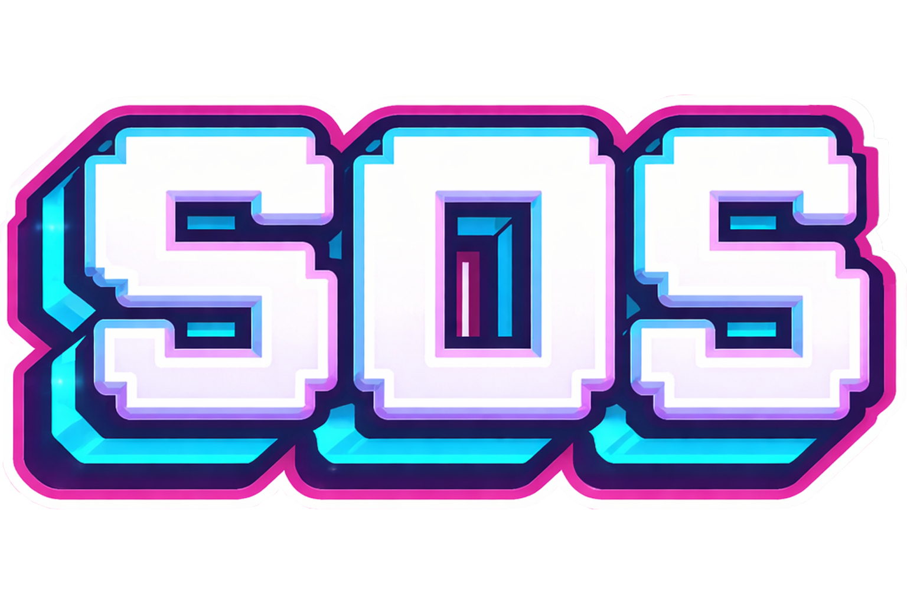
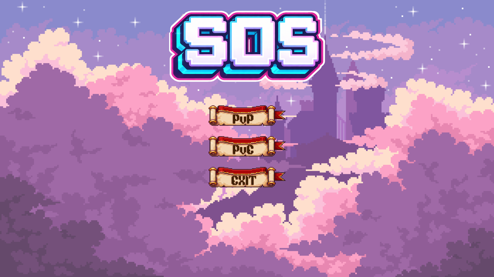
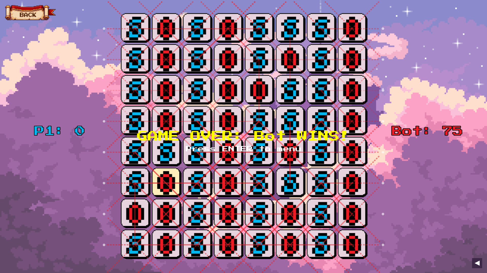

# SOS Game - Ultimate Edition



A modern, feature-rich implementation of the classic pen-and-paper game **SOS**, built with Python and Pyglet. This version introduces advanced gameplay mechanics like **Orbit Mode**, a sleek UI with animations, and a powerful AI opponent based on **AlphaZero**.

## 🌟 Key Features

### 🎮 Game Modes
*   **Player vs Player (PvP)**: Challenge a friend on the same device.
*   **Player vs Bot (PvE)**: Test your skills against the AI.
    *   **Greedy Bot**: A fast-paced bot that seizes immediate opportunities.
    *   **AlphaZero AI**: A deep-learning neural network trained to master strategy (See [AI Architecture](docs/AI.md)).

### 🌀 Orbit Mode
Transform the board into a **toroidal surface**!
*   Edges wrap around: Top connects to Bottom, Left connects to Right.
*   Diagonals wrap across corners.
*   Visual cues (Ghost Dots) help you see connections across boundaries.
*   See [Rules](docs/RULES.md) for detailed mechanics.

### 📊 Enhanced UI & Experience
*   **Move History**: Track every move with a dedicated, toggleable side panel.
*   **Interactive Animations**: Smooth transitions, Hover effects, and Dynamic Sine-Wave shaders.
*   **Grid Coordinates**: Chess-style (A1-H8) labels for precise play.
*   **Replay System**: Review your games move-by-move.

## 🚀 Installation

1.  **Clone the repository**:
    ```bash
    git clone https://github.com/yourusername/sos-game.git
    cd sos-game
    ```

2.  **Install dependencies**:
    ```bash
    pip install -r requirements.txt
    ```

## 🕹️ Usage

**Start the Game**:
```bash
python sos.py
```

**Train the AI** (Optional):
```bash
python train_alpha.py --scratch
```

## 📸 Screenshots


### Main Menu

*Start PvP, PvE, or adjust settings.*

### Gameplay - Orbit Mode

*Notice the Ghost Dots indicating wrapped connections.*

### Greedy Bot Challenge

*A final board state from a game against the Greedy Bot.*

---

## 🧠 AI Model
The game features a custom **AlphaZero** implementation using PyTorch.
*   **Architecture**: ResNet (6 Blocks, 128 Filters).
*   **Input**: 8x8x6 Grid Tensor.
*   **Training**: Self-Play Reinforcement Learning with MCTS.
*   Read more in [AI Architecture](docs/AI.md).

## 📜 Rules
For a complete guide on how to play, including special Orbit Mode edge cases, see [RULES.md](docs/RULES.md).

## 📄 License
This project is licensed under the MIT License - see the [LICENSE](LICENSE) file for details.
