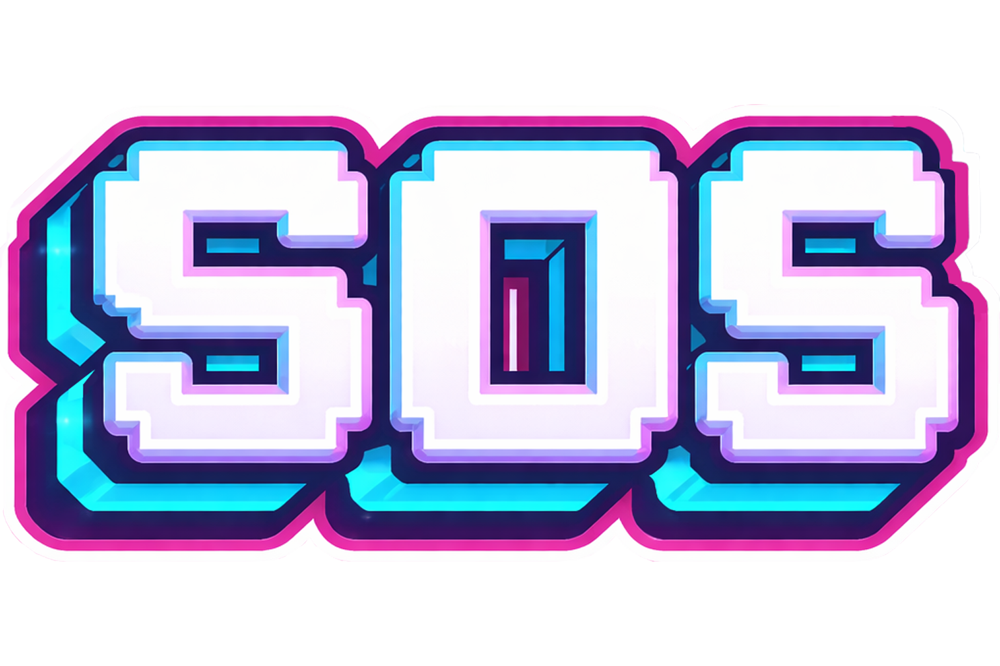
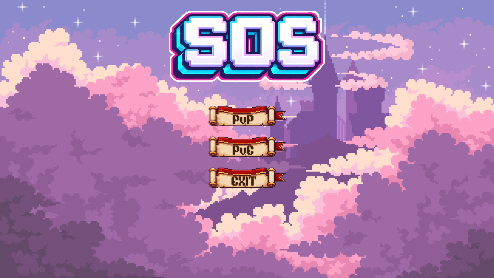
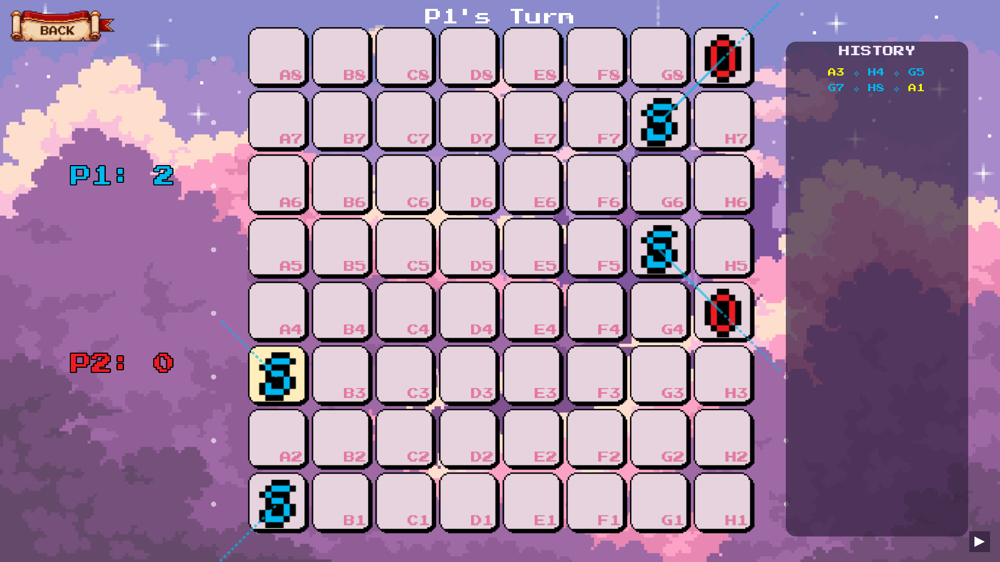
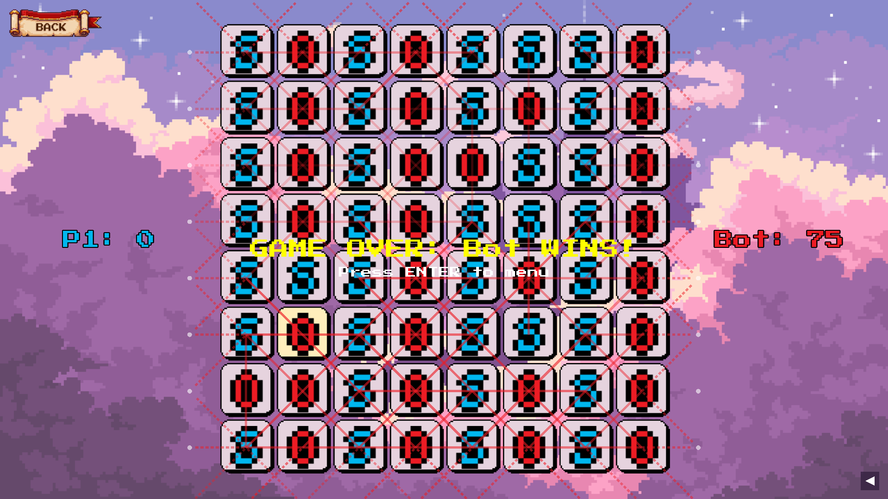

# SOS Game - Ultimate Edition



A modern, feature-rich implementation of the classic pen-and-paper game **SOS**, built with Python and Pyglet. This version introduces advanced gameplay mechanics like **Orbit Mode**, a sleek UI with animations, and a genuinely strong AI opponent driven by an **alpha-beta search engine**.

## 🌟 Key Features

### 🎮 Game Modes
*   **Player vs Player (PvP)**: Challenge a friend on the same device.
*   **Player vs Bot (PvE)**: Test your skills against the AI.
    *   **Fast**: the search engine on a 0.8 s clock — answers immediately, still strong.
    *   **Deep**: the same engine on a 3 s clock — the strongest setting.
    *   Both slots run `strong_bot.py`, so the menu choice is a speed dial rather than a strong/weak lottery (See [AI Architecture](docs/AI.md)).

### 🌀 Orbit Mode
Transform the board into a **toroidal surface**!
*   Edges wrap around: Top connects to Bottom, Left connects to Right.
*   Diagonals wrap across corners.
*   Visual cues (Ghost Dots) help you see connections across boundaries.
*   See [Rules](docs/RULES.md) for detailed mechanics.

### 📊 Enhanced UI & Experience
*   **Move History**: Track every move with a dedicated, toggleable side panel.
*   **Interactive Animations**: Smooth transitions, Hover effects, and Dynamic Sine-Wave shaders.
*   **Grid Coordinates**: Chess-style (A1-H8) labels for precise play.
*   **Replay System**: Review your games move-by-move.

## 🚀 Installation

1.  **Clone the repository**:
    ```bash
    git clone https://github.com/yourusername/sos-game.git
    cd sos-game
    ```

2.  **Install dependencies**:
    ```bash
    pip install -r requirements.txt
    ```

## 🕹️ Usage

**Start the Game**:
```bash
python sos.py
```

**Measure the AI** (bot vs bot, parallel across cores):
```bash
python arena.py strong:1.0 smart:1.0 --games 16
python test_strong_bot.py          # correctness, incl. brute-forced endgames
```

**Train the neural branch** (optional, and not what you play against — see
[AI Architecture](docs/AI.md) section 7 for why):
```bash
python distill_train.py --games 150 --epochs 12
```

## 📸 Screenshots


### Main Menu

*Start PvP, PvE, or adjust settings.*

### Gameplay - Orbit Mode

*Notice the Ghost Dots indicating wrapped connections.*

### Greedy Bot Challenge

*A final board state from a game against the Greedy Bot.*

---

## 🧠 AI Engine
The opponent is an **alpha-beta search engine** (`strong_bot.py`), not a neural net.

*   **Rules core**: the board as 256 three-slot SOS "lines", so a move's points
    and the whole threat set are O(1) lookups (~190k make/unmake per second).
*   **Search**: negamax on score differential with the bonus turn folded in,
    depth counted in *turns*, transpositions keyed on the board alone, and the
    endgame **solved exactly** from ~13 empty cells down.
*   **Leaf evaluation**: a greedy playout to the end of the game. This is the
    part that mattered — swapping a standard quiescence leaf for it took the
    engine from losing 4-11 to winning 14-2 against the previous bot.
*   **Measured**: 31-9 (78%) over 40 games against the old `smart_bot` at equal
    time, and 14-1-1 against `greedy`; still 12-4 while thinking for 0.8 s
    against `smart_bot` on 2.5 s. The deep slot earns its clock — 88-90%
    against a fixed reference, against 80% for a quarter-second budget.
*   Full write-up, including why the neural branch was benched:
    [AI Architecture](docs/AI.md).

## 📜 Rules
For a complete guide on how to play, including special Orbit Mode edge cases, see [RULES.md](docs/RULES.md).

## 📄 License
This project is licensed under the MIT License - see the [LICENSE](LICENSE) file for details.
