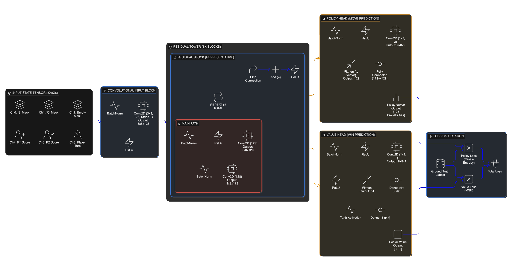

# AlphaZero AI Architecture

This project implements a state-of-the-art AI agent based on the **AlphaZero** algorithm, capable of mastering the SOS game through self-play reinforcement learning.

## Neural Network Architecture
The core "brain" of the AI is a **Deep Residual Network (ResNet)** designed to predict optimal moves and evaluate board positions.

### input representation
The game state is encoded into an `8x8x6` tensor:
*   **Channel 0**: 'S' pieces (Boolean mask)
*   **Channel 1**: 'O' pieces (Boolean mask)
*   **Channel 2**: Empty cells (Boolean mask)
*   **Channel 3**: Current Player turn (0 or 1 plane)
*   **Channel 4**: Player 1 Score (Normalized)
*   **Channel 5**: Player 2 Score (Normalized)

### Network Layers
*   **Convolutional Input Block**: Initial feature extraction.
*   **Residual Tower**: **6 Residual Blocks** with **128 Filters** each, enabling deep learning of complex spatial patterns.
*   **Policy Head**: Outputs a probability distribution over all possible moves (128 actions: 64 cells * 2 symbols).
*   **Value Head**: Outputs a scalar value [-1, 1] estimating the probability of winning from the current state.

## Monte Carlo Tree Search (MCTS)
The AI uses MCTS to look ahead and simulate future game states.
*   **Simulations per Move**: **200**
*   **Exploration Constant (c_puct)**: **1.0**
*   **Selection**: Uses Upper Confidence Bound (UCB) guided by the Neural Network's prior probabilities.

## Training Configuration & Roadmap

The AI is designed to scale from a lightweight testing configuration to a "Grandmaster" level agent.

| Parameter | Value | Effect |
| :--- | :--- | :--- |
| **iterations** | 1000 | The main "intelligence" loop. |
| **self_play_games** | 50 | More experience per loop. Total games: 50,000. |
| **num_simulations** | 200 | MCTS Depth. Deeper analysis = higher quality data. |
| **num_res_blocks** | 6 | "Brain size". More blocks hold more complex strategies. |
| **num_channels** | 128 | "Idea bandwidth". Captures more subtle board patterns. |

## Neural Network Block Diagram

## Diagram Annotations & Key Highlights

For your block diagram, consider highlighting these unique aspects of the AlphaZero implementation for SOS:

1.  **Dual Action Output (Policy Head)**:
    *   Unlike Go (Move only) or Chess (Move piece), SOS requires choosing **Piece Type ('S' or 'O')** per cell.
    *   **Annotation**: "Output Vector Size 128: [0-63] = Place 'S', [64-127] = Place 'O'".

2.  **Score-Aware Input (Input Block)**:
    *   The game state is not just board positions; the current score difference is critical for strategy.
    *   **Annotation**: "Channels 4-5 encode Normalized Player Scores".

3.  **Turn-Sensitive Value**:
    *   Due to bonus turns, the value prediction is strictly for the **Current Player**, which may not alternate every turn.

## Performance
Even with limited training, the AlphaZero AI demonstrates strategic depth, capable of:
*   Blocking opponent SOS attempts.
*   Setting up multi-point combinations.
*   Utilizing Orbit Mode wrapping to create unexpected connections.
*   Adapting to both Standard and Wrapped board topologies.
