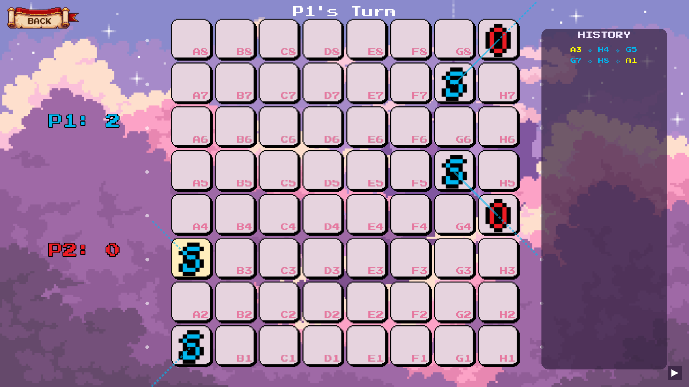

# SOS Game Rules

## Objective
The goal of the game is to form the sequence **S-O-S** in a straight line (horizontal, vertical, or diagonal). The game ends when the board is full, and the player with the most SOS formations wins.

## Basic Gameplay
1.  **Grid**: The game is played on an 8x8 grid.
2.  **Turns**: Players take turns placing either an 'S' or an 'O' in an empty cell.
3.  **Scoring**:
    *   Forming an SOS sequence earns **1 point**.
    *   If a move creates an SOS, the player gets a **bonus turn**.
    *   A single move can create multiple SOS formations (e.g., placing an S that connects two existing O-S sequences). Each counts as a point.

## Orbit Mode (Advanced Feature)
Orbit Mode transforms the standard grid into a **toroidal surface**, meaning the edges wrap around to the opposite side. This creates new strategic possibilities where lines can cross the boundaries of the board.

### Mechanics
*   **Vertical Wrap**: The **Top Row (Row 8)** connects directly to the **Bottom Row (Row 1)**.
    *   *Example*: An 'S' at `A8` (Top-Left) and an 'S' at `A2` (Bottom-Left) can be connected by an 'O' at `A1` (Bottom-Left edge). wait, A1 is bottom.
    *   *Correction*: `A8` (Top) -> `A1` (Bottom). An SOS can be formed by `S(A8) - O(A1) - S(A2)`.
*   **Horizontal Wrap**: The **Left Column (Col A)** connects directly to the **Right Column (Col H)**.
    *   *Example*: `S(H4) - O(A4) - S(B4)` is a valid sequence.
*   **Diagonal Wrap**: Diagonals also wrap around corners.
    *   *Example*: `S(H8)` (Top-Right) connects to `O(A1)` (Bottom-Left) if following a diagonal path.
    *   *Edge Case*: A diagonal line starting at `G8` (Top, 2nd from Right) moving Up-Right:
        1.  `G8`
        2.  `H1` (Wrapped to Bottom, moved Right)
        3.  `A2` (Wrapped to Left, moved Up)

### Visual Aid

In Orbit Mode, **ghost dots** appear around the grid edges. These dots represent the cells on the opposite side of the board, helping you visualize potential wrapped connections.

## Game Modes
*   **Player vs Player (PvP)**: Challenge a friend on the same device.
*   **Player vs Bot (PvE)**: Play against the AI.
    *   **Greedy Bot**: Chooses moves that immediately score points.
    *   **AlphaZero Bot**: A neural-network-powered AI (see [AI Model](AI.md)).
