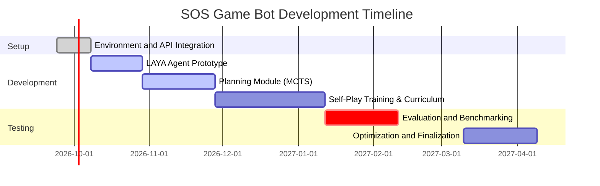

# Executive Summary  
The LAYA “System-1” model is an open, 421M-parameter classification network (no text generation) that makes fast, one-shot decisions from a structured state.  It has been demonstrated in real games: e.g. a local Snake agent ran at ~63.6 moves/sec with zero deaths, and a toy Doom agent used LAYA for yes/no combat decisions with hand-crafted safety overrides.  In a Chrome T-Rex (dinosaur) game, LAYA answered jump/duck/run queries every frame (33 ms per query) while a competing paid model took ~369 ms, letting LAYA make ~2,753 moves vs 197 for the other.  Building on these insights, we propose an SOS-game bot architecture that combines LAYA’s rapid “intuition” with planning/search techniques.  We survey implementations (Snake, Doom, etc.), extract key patterns (data flow, modules, latency), and evaluate advanced strategies (MCTS, self-play, imitation, heuristics).  Our recommended design uses LAYA for low-latency move selection, a higher-level planner (e.g. MCTS) for deeper tactics, and a curriculum/self-play training loop.  We conclude with a modular implementation plan, milestones and testing protocols, and performance targets.  

## Real-World LAYA System-1 Implementations in Games  
Developers have already tested LAYA-like models in simple games. Key examples:  

- **Snake (grid game):** A terminal-based Snake game was driven by LAYA via a three-question loop.  Each move invoked the LAYA model (with a cyclic safety layer) to choose the direction.  On an Apple M3 Max, this agent achieved **63.6 steps/s over 2,400 moves (0 deaths)** in a benchmark.  This demo’s code and results are in the *laya-vs-jev* GitHub repo (virajbhartiya), which logs every decision and uses MLX for fast inference.  

- **Chrome T-Rex (endless runner):** A side-by-side demo had LAYA (local MLX) and TypeSafe’s Jev (cloud API) play the offline dinosaur game.  Every frame posed the same multiple-choice question (“jump”, “duck”, “run”) to both models.  Neither was trained on the game, yet LAYA’s local 13–33 ms responses (avg. 33 ms/decision) let it survive much longer than Jev (369 ms/decision).  In a 90-second test LAYA made 2,753 moves (best score 257, 4 deaths) vs Jev’s 197 moves (score 110, 11 deaths).  (These demos are in the same *laya-vs-jev* repo.)  

- **Doom (3D shooter):** An experiment by Christian Graham used LAYA to play (a portion of) a Doom level.  Rather than raw graphics, the agent asked focused yes/no or multiple-choice questions each tick.  For example, “Should I shoot?” was a separate question with a binary answer.  Simple rule-based checks were added: e.g. “if no ammo, override the shoot answer” and “do not spin in place endlessly”.  With these fixes, LAYA managed to clear rooms and explore (using additional heuristics like wall-following when stuck).  This case shows LAYA can handle messy, partially-seen environments if paired with domain logic.  

These examples come with source code or writeups.  The Snake and T-Rex demos (Python/MLX code) are on GitHub.  The Doom experiment is described in a Medium blog.  Together they illustrate how a System-1 model can be slotted into a game loop, with data flow and safety rules tailored to the game.  

## Architectural Patterns and Integration  
LAYA is a pure decision model: it takes a *state* and *typed question(s)* as input and returns *choices/score* answers in one forward pass.  In our SOS bot, the architecture will follow a similar pattern:

- **Data flow & modules:**  Each game state (full SOS board, current player, score) is encoded (e.g. JSON or structured prompt) and fed to LAYA along with pre-defined questions. For example, questions might include “Which empty cell should I mark?” (type = choice) or “Does placing ‘S’ here create an SOS?” (yes/no). LAYA’s Router can auto-select an English or multilingual checkpoint. The output is a probability distribution over answers (or a boolean probability).  A decision module then interprets LAYA’s answer into a concrete move.  The system may also include a **safety layer** of simple rules: e.g., disallow moves that immediately lose the game or loop forever (as done in the Doom case). A higher-level planner (System-2) can run in parallel (see Strategies below).  

- **Training vs. Inference:**  LAYA is *pre-trained* offline using RLCD (policy-gradient reinforcement learning with proper-scoring rewards).  This ensures its output probabilities are calibrated to true likelihoods.  Training (data collection, RL updates) happens separately; our bot will mainly use LAYA in *inference mode*.  Inference is extremely fast: on modern hardware LAYA answers in the range of 13–40 ms for short queries.  No text generation is needed (0 tokens output), so latency is just one pass through the bidirectional encoder.  

- **Latency and compute:**  The cited demos achieved very low latencies.  On an Apple M3/Max, LAYA’s 421M model (FP16) had median 13.4 ms per query.  In practice, even on a gaming PC with a CUDA GPU (our assumed target: 16 GB RAM, AMD RX 6700M), we expect <50 ms per decision.  For context, LAYA answered 2,753 moves in 90 s (~30.6 moves/s) in the T-Rex test, and 63.6 moves/s in uncapped Snake mode.  We should aim to sustain 20–30 decisions per second at minimum, so that the bot can play real-time (e.g. 30–60 Hz turns).  On the flip side, cloud API (Jev) is much slower (~369 ms), so local inference is critical for speed and cost.  

- **State management and memory:**  SOS is fully observable, so the entire board state will be sent each move.  We might maintain a history buffer of past states/actions for self-play training.  Model-wise, LAYA’s 421M parameters occupy a few hundred MB (FP16).  Using MLX or PyTorch, this fits in GPU memory (e.g. ~1 GB for the largest checkpoint).  Preloading the model into memory avoids multi-second loads per request.  Aside from LAYA, other modules (search tree, experience replay) will use additional RAM/compute but within the specs of a typical PC.  

- **Game loop integration:**  In the game loop, at each turn the bot will “ask” LAYA (and possibly search) for a move.  For example, in the Snake demo every frame invoked LAYA.  In T-Rex, each obstacle frame ran a LAYA query.  In SOS, we would similarly call `laya.predict(state, questions)` once per turn.  If multiple sub-questions are needed (e.g. evaluate ‘S’ vs ‘O’ separately), we might batch them.  The model’s returned confidence can also be used to trigger fallback logic (e.g. if no move has high confidence, activate System-2 search).  

- **Reward shaping and curriculum:**  The natural reward in SOS is simply +1 per “SOS” completed (and +0 to opponent if you block them).  We may augment this with small rewards for controlling key cells or preventing opponent SOS.  A **curriculum** could start on small boards or with cooperative goals (e.g. count how many SOS exist) before full competition.  Trade-offs include the risk of overfitting to an artificial reward.  Designing rewards carefully will be part of implementation, as is standard in RL-based bots.  

The following mermaid diagram illustrates the high-level agent architecture: it shows game state encoding feeding both LAYA (System-1) and a planning module (System-2), whose outputs are combined into the final action.  

```mermaid
flowchart LR
    GameEnv[Game Environment (SOS)] -->|state| StateEnc[State Encoder (JSON/Text)];
    StateEnc -->|input to LAYA| LayaModel[LAYA Decision Model];
    StateEnc -->|input to Planner| Planner[Planner (MCTS/Search)];
    LayaModel --> Combiner[Decision Logic & Safety];
    Planner --> Combiner;
    Combiner -->|chosen action| Action[Execute Move];
    Action --> GameEnv;
```  

## Advanced Strategies and Tactics  
To maximize strength, the SOS bot can combine multiple AI strategies.  Below we outline key approaches, their applicability to SOS, implementation steps, pros/cons, and resource needs.  

- **Monte Carlo Tree Search (MCTS) / Planning:** *Applicability:* Very good. SOS is a deterministic, perfect-information game, making it ideal for tree search. *Implementation:* Treat the game rules as a simulator and use MCTS to explore future move sequences. LAYA can serve as a fast policy/value network to bias the search (akin to AlphaGo’s approach). For example, at each turn run MCTS for a fixed time, using LAYA’s probabilities to guide playouts or evaluate leaf nodes. *Pros:* Finds strong moves by looking ahead; can correct LAYA’s myopic decisions. *Cons:* Computationally expensive (each move may require thousands of simulations). *Requirements:* A fast game simulator (already available), and moderate CPU/GPU. *Metrics:* Search depth, number of nodes visited, win-rate vs baseline, computation time per move.  

- **Self-Play Reinforcement Learning:** *Applicability:* High, for end-to-end skill. *Implementation:* Let two copies of the bot play against each other repeatedly. After each game (or batch), use the outcomes to fine-tune the model. Since LAYA is a fixed-size classifier, one approach is to collect states and best-play moves from self-play and re-train LAYA (or a separate RL network) to predict the winning strategy. *Pros:* Gradually discovers optimal play without human data (AlphaZero famously did this in Go/chess). *Cons:* Very resource-intensive; risk of slow convergence or cycling between strategies. *Requirements:* Potentially thousands of games of self-play (can be accelerated by parallelism), and GPU time to update models. *Metrics:* Elo or win-rate improvement over generations, loss convergence, variance in outcomes.  

- **Imitation Learning (Supervised):** *Applicability:* Useful for bootstrapping. *Implementation:* Generate a dataset of “expert” SOS games (could be from heuristics or human demonstration) and train LAYA to mimic the best moves (e.g. treat it as a classification problem). This might involve fine-tuning with RLCD on labeled move data. *Pros:* Quickly achieves reasonable play by imitating good strategies. *Cons:* Limited by the quality/diversity of demonstration data; may not surpass experts. *Requirements:* A dataset of expert moves (even synthetic heuristics can be used), modest compute for supervised training. *Metrics:* Accuracy of predicted moves on validation set, win-rate of cloned policy vs heuristic.  

- **Curriculum Learning:** *Applicability:* Helps when learning from scratch. *Implementation:* Start training/playing on easier versions of SOS (smaller board, cooperative scoring, or fixed opponent strategy) and gradually increase difficulty. For example, first train on 3×3 board, then 5×5, then full-size. *Pros:* Simplifies learning by staged tasks; can stabilize training. *Cons:* Requires designing multiple scenarios; time spent on simpler games might delay full-game progress. *Requirements:* Multiple environment configurations, plus the same training framework. *Metrics:* Learning curve speed at each stage, transfer performance to full game.  

- **Exploration vs. Exploitation:** *Applicability:* Critical in learning. *Implementation:* If using RL or search, implement strategies like ε-greedy or UCB (in MCTS) to balance exploring new moves vs. exploiting known good ones. For instance, in MCTS the UCB criterion automatically handles this trade-off. In policy training, add entropy regularization. *Pros:* Ensures the bot doesn’t get stuck in suboptimal play. *Cons:* Too much exploration can slow progress; too little can converge prematurely. *Requirements:* Algorithmic only (no extra data), but tune hyperparameters. *Metrics:* Exploration rate, diversity of moves, regret minimization.  

- **Heuristic Rules / Safety Checks:** *Applicability:* Always useful as a safety net. *Implementation:* Hard-code obvious SOS-specific tactics or avoidances. For example, if placing ‘O’ cannot form an “SOS” when it’s your turn, skip it; or if the opponent is about to win next move, prioritize blocking. The Doom example added rules like “never fire without ammo” and “don’t circle endlessly”. *Pros:* Immediately handles edge cases and pruning; increases robustness. *Cons:* Manual and game-specific; may conflict with learned strategy or oversimplify. *Requirements:* Domain knowledge, little compute. *Metrics:* Reduction in illegal or fatal moves, improved win-rate stability.  

- **Ensemble Methods / Meta-Strategies:** *Applicability:* Can boost robustness. *Implementation:* Train multiple LAYA instances (with different seeds or slight variations) and combine their outputs (e.g. majority vote or weighted average). Or ensemble LAYA with another model (like a value network). *Pros:* Averages out individual model errors; can capture diverse tactics. *Cons:* Increased inference cost (multiple forward passes); complexity. *Requirements:* Multiple copies of the model (more memory/compute). *Metrics:* Ensemble vs single-model win-rate, consistency variance.  

- **Adversarial Training (Robustness):** *Applicability:* For test-time reliability. *Implementation:* Create adversarial game states (e.g., near-endgames or illegal configurations) and ensure the bot handles them gracefully, possibly retraining on these cases. This is akin to stress-testing the model. *Pros:* Improves worst-case performance. *Cons:* Hard to define exhaustive adversarial states; may require manual curation. *Requirements:* Simulation of corner cases; retraining overhead. *Metrics:* Bot’s success rate under perturbed or extreme scenarios.  

Each strategy can be mixed. For example, use imitation learning to initialize LAYA, then refine with self-play+MCTS, while always applying safety heuristics.  In practice, we expect a **hybrid approach**: use LAYA for fast moves augmented by occasional deeper search (MCTS) and continuous self-play training.  

A summary table is below:

| Strategy            | Applicability (SOS)       | Implementation                                         | Pros                                            | Cons                               | Resources/Data               | Evaluation Metrics         |
|---------------------|---------------------------|--------------------------------------------------------|-------------------------------------------------|------------------------------------|------------------------------|----------------------------|
| **MCTS (Planning)** | Perfect info, turn-based  | Integrate LAYA as policy/value guide in tree search | Finds deep strategies; can correct LAYA’s shortsightedness | Computationally heavy per move       | Simulator & CPU/GPU for rollouts | Win-rate vs baseline; search depth; time/move |
| **Self-Play RL**    | Full strategy learning    | Let bot play itself repeatedly, update policy after each game | Learns optimal play without human data (AlphaZero) | Very expensive; risk of instability | Thousands of simulated games; GPU/TPU | Elo rating; convergence of win-rate |
| **Imitation L.**    | Fast bootstrap           | Train LAYA on expert SOS games (supervised)           | Quickly learns reasonable play; safe start        | Limited by demo quality; may plateau | Dataset of SOS games/moves   | Move prediction accuracy; initial win-rate |
| **Curriculum L.**   | Learning efficiency      | Start on smaller boards or easier rules, scale up     | Eases training; stabilizes learning              | Requires multiple env. versions     | Modified game environments   | Learning speed; transfer performance |
| **Exploration**     | Avoid local optima       | Use ε-greedy or UCB in selection (in RL/MCTS)         | Ensures new strategies explored                  | Can slow progress if too random     | Algorithmic (no extra data)  | Exploration vs. regret, diversity of play |
| **Heuristics/Safety**| Edge-case handling       | Hand-coded rules (e.g. block opponent’s SOS)           | Fixes obvious errors; ensures legality           | Game-specific; may conflict with ML  | Game logic only             | Reduction of illegal moves; robustness |
| **Ensemble Models** | Robustness               | Combine multiple LAYA models or LAYA+value net        | Averages out model errors; more stable           | Doubles compute; complexity adds up | Additional models (~x2 memory)| Ensemble vs solo win-rate; variance |
| **Adversarial Training** | Robustness           | Train with perturbed states or opponents            | Improves worst-case handling                     | Difficult to cover all cases        | Curated adversarial scenarios| Stress-test win-rate        |

## Recommended Architecture & Plan  
Combining the above, we propose a modular architecture (diagrammed above) with milestones as follows:

1. **Environment & Infrastructure Setup (Weeks 1–2):** Integrate the SOS game engine (rules, state representation) and build interfaces for bot integration. Develop state encoder (JSON or tensor) and simple LAYA API calls (using the official Router or MLX port). *Milestones:* Verified game API; LAYA successfully called on a sample state.  

2. **Basic LAYA Bot (Weeks 3–5):** Implement the primary agent loop using LAYA alone. For each turn, query LAYA with a choice question (“Which move?”) and a boolean question (“Will this score 1 point?”) as needed. Map LAYA’s outputs to board actions. Add minimal safety rules (e.g. “do not lose in one move”). *Milestones:* Bot completes games using only LAYA with >0% wins against a baseline heuristic.  

3. **Search Module (Weeks 6–10):** Develop a planning component (e.g. MCTS). Use LAYA as the rollout policy or value function during search. Ensure it can interrupt and return the best move within given time. Tune search parameters (breadth vs depth). *Milestones:* Bot plays with LAYA+MCTS; measured decision time and improved win-rate over LAYA-only.  

4. **Training Loop (Weeks 11–15):** Set up training procedures. Collect self-play games (or use predefined expert games) and fine-tune LAYA via RLCD. Apply curriculum: start training on smaller boards or with lenient opponent, then scale up. *Milestones:* Training scripts running; observe learning (increasing win-rate) on progressively harder boards.  

5. **Testing & Evaluation (Weeks 16–17):** Systematically test the bot. Use automated matches against fallback bots (random, heuristic) and record metrics: win-rate, average points, decision time. Conduct ablation studies (e.g. LAYA-only vs LAYA+MCTS). Perform stress tests (fast decisions, edge cases). *Milestones:* Performance benchmarks collected; bot meets targets (e.g. >90% win vs random; <50 ms avg decision).  

6. **Iteration & Deployment (Weeks 18–20):** Refine based on test results. Optimize LAYA model usage (batch queries, FP16), further tune search depth, finalize safety logic. Prepare final benchmarks and documentation. *Milestones:* Final version passes acceptance criteria (performance targets, reliability); architecture diagrams and code repository delivered.  

Throughout, **testing protocols** include unit tests for the state/decision pipeline, integration tests (running full games end-to-end), and performance benchmarks (like those in the LAYA repo). We will measure **performance targets** such as decision latency (aim <50 ms), decision rate (>20–30 per second), win-rate against fixed strategies (>95%), and resource usage (GPU memory within 8 GB).  



## References  
- **LAYA Model:** Open-source System-1 decision engine (ModernBERT, 421M parameters).  
- **Snake Demo:** Viraj Bhartiya’s *laya-vs-jev* repository (Snake), showing 63.6 moves/s with zero deaths.  
- **T-Rex Demo:** *laya-vs-jev* docs (T-Rex) – LAYA vs Jev comparison in Chrome Dino game.  
- **Doom Experiment:** Christian Graham (Medium) – LAYA playing Doom with added safety rules.  
- **AlphaGo/AlphaZero:** DeepMind’s self-play MCTS methods for Go/chess; see AlphaGo’s MCTS use and AlphaZero’s self-play learning.  
- **LAYA Technical Docs:** HuggingFace model card and GitHub (Router API usage, multilingual support).  

